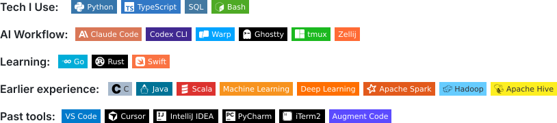

# Tech Stack & Working Style

[中文](TECH_STACK_CN.md) · [← Back to profile](README.md)

> I build local-first AI products and developer tools that turn ambiguous, repetitive work into explicit systems people can inspect, edit, and reuse.

## Stack map

The map distinguishes the tools I use now, areas I am deepening, earlier experience, and tools I have moved on from.

  <picture>
    <source media="(max-width: 600px)" srcset="assets/badges/profile-en-mobile.svg">
    
  </picture>

## Current focus

| Area | Stack | What I use it for |
| --- | --- | --- |
| AI & automation | `Python` · `TypeScript` · `SQL` · `Bash` | Research agents, structured content workflows, data processing, and task automation |
| Product engineering | `React` · `Next.js` · `Vite` · `PostgreSQL` | Local-first workbenches, growth experiments, landing pages, and conversion tracking |
| Developer tools | `Rust` · `Node.js` · `macOS automation` | Small, scriptable CLIs with predictable output and clear safety boundaries |
| AI-assisted delivery | `Claude Code` · `Codex CLI` · `Git` · `tmux` | Planning, implementation, review, verification, and documentation |

## Representative projects

- **[GrowthLab](https://github.com/tinylion1024/GrowthLab)** — A local-first AI growth experiment workbench for turning a growth question into an editable, testable plan. `React 19` · `TypeScript` · `Vite` · `Zod`
- **[LaunchKit](https://github.com/tinylion1024/LaunchKit)** — A lightweight campaign builder for publishing landing pages, collecting leads, and measuring real conversion funnels. `Next.js 16` · `React 19` · `Prisma` · `PostgreSQL`
- **[osamail](https://github.com/tinylion1024/osamail)** — A local-first Apple Mail CLI for reading, organizing, automating, and sending mail without another credentials flow. `Rust` · `JXA` · `macOS`
- **[aenv](https://github.com/tinylion1024/aenv)** — A project-local environment manager that initializes, audits, compares, and protects Claude Code and Codex setups. `TypeScript` · `Node.js` · `CLI`

## How I work

`Research → Frame → Build → Verify → Document → Reuse`

- **Research and frame** — turn a fuzzy problem into assumptions, constraints, success metrics, and a small testable scope.
- **Build and verify** — use AI to accelerate implementation, then rely on types, tests, linting, review, and real workflows to decide whether it is done.
- **Document and reuse** — keep decisions, commands, and operating knowledge close to the repository so the next run starts from a stronger baseline.

## Engineering principles

- **Local-first when practical.** Keep data and credentials on the user's machine unless a server creates clear product value.
- **Explicit state over hidden magic.** Prefer inspectable files, deterministic commands, dry runs, and structured output.
- **Small tools that compose.** A focused CLI or workbench should fit naturally into an existing workflow.
- **AI accelerates; verification decides.** Generated code is a draft until checks and real usage support it.
- **Optimize for repeatability.** A good workflow should become easier to run, explain, and improve the second time.

### Learning with a purpose

- **Go** — compact services and operational tooling.
- **Rust** — safer systems programming and production-grade CLI design, applied in [osamail](https://github.com/tinylion1024/osamail).
- **Swift** — native macOS utilities and deeper platform integration.

### Earlier experience

My earlier work spans `C`, `Java`, `Scala`, machine learning, deep learning, `Apache Spark`, `Hadoop`, and `Hive`. That background still shapes how I think about data pipelines, system boundaries, and operational reliability, even when the current product needs a much smaller stack.
