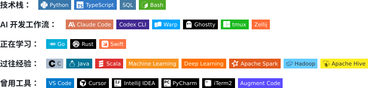

# 技术栈

[English](TECH_STACK.md) · [← 返回个人主页](README_CN.md)

我主要使用 Python 和 TypeScript 构建 AI 辅助研究、增长系统、自动化流程与轻量开发者工具。下图分别展示当前技术栈、AI 工作流、学习方向、过往经验和已经迁移离开的工具。

  <picture>
    <source media="(max-width: 600px)" srcset="assets/badges/profile-cn-mobile.svg">
    
  </picture>

